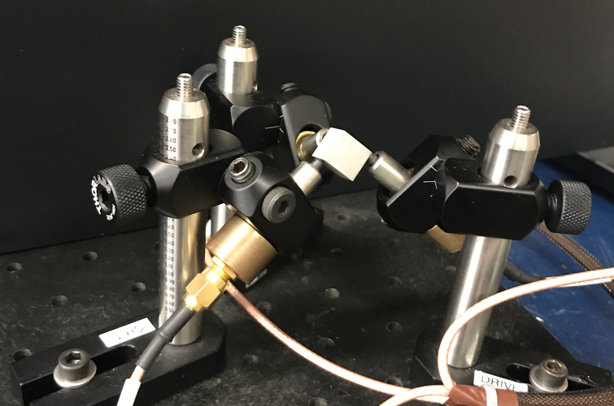

## (or, more accurately, how we mixed our little science code into Stan and out modeling progress thus far)

This is a write-up of the experience we (two engineering graduate students) had integrating some custom software (a model of mechanical resonance in linear elastic materials) into Stan.

We started off using Bayesian inference on our problem because the optimization techniques we tried weren't working. At the recommendation of a coworker, we made a small sampler using Radford Neal's "MCMC Using Hamiltonian Dynamics" paper [@radford2012] and it surprised us how well it worked (and how consistently reasonable the answers were). Eventually we moved to Stan to take advantage advanced samplers and modeling language flexibility.

We'll save the preaching for the conclusion, but it's our opion that everyone out there with little science codes should be hooking them up to Stan. Be they weird ODEs, or complex PDEs, or whatever. This notebook is here to facilitate this.

Shoutouts to Ben Goodrich and Bob Carpenter for walking us through this originally. The implementation here takes advantage of special interfaces in RStan and CmdStan. I'm not sure how well any of this information transfers to the other interfaces (PyStan, MatlabStan, ...).

We start with a little background on our problem. It's optional, but it should help motivate what we're doing. We then walk through the math for a simple 1D version of our problem, how to implement this in Stan and eventually how to interface external software with Stan to solve this problem (that uses efficient, custom gradients instead of relying entirely on autodiff). Finally we go over the state of our modeling efforts and what the problems are.

## Application Background (Optional)

The problem we worked on was the inference bit of Resonance Ultrasound Spectroscopy (or more shortly, RUS). RUS is the process of extracting elastic constants (how difficult an object is to stretch and deform) of a material by measuring the resonance modes (frequencies) of a sample of that material.

Musical instruments are the standard examples of mechanical resonance at work, though occasionally a bridge will do it as well. The important bit is that the shape and materials of the thing determine at what frequencies it resonates. For the most part, we know how things are shaped, and we can measure where they resonate, and so the RUS game is all about backing out the elastic constants (a couple standard references on this are [@visscher1991c] and [@migliori1993c]).

). Picture from [Wikipedia](https://upload.wikimedia.org/wikipedia/commons/3/38/Millenium_bridge_2015.jpg)*](millenium_bridge.jpg)

We don't work with musical instruments or bridges though. The driving application here is gas turbines (see: jet engines, and land based gas power generation). The bits of the gas turbine that need to get hot (the blades and the rotor especially) are made of special, high temperature resistant metals called superalloys. It's the elastic constants of superalloys that we want to know.

For superalloys, RUS gives us a few things:

1. High precision estimates of elastic constants (conventional mechanical testing only accurate to 10%~ or so)
2. A way to evaluate the mechanical properties of materials at high operating temperatures (we're not quite there yet, but I know the collaborators are moving in this direction and I'm excited to see how it works)
3. A less-destructive way to evaluate samples (you still have to destroy blades to get samples, but at least you don't have to destroy samples to get data)

This all goes into operating turbines safely at high temperatures (which makes them more efficient).

The actual experiment works by vibrating the sample at a range frequencies and then measuring the amplitude of the response. If there is a very high peak, it is recorded as a resonance mode (this process is mostly automated).

Here's a picture of a typical RUS cradle with a little sample resting in it.



## Basic Mechanics (At least kinda pay attention to this)

Our application is in three dimensions, but we'll start with 1-dimensional problem. Here is a series of point masses connected by massless, perfectly linear springs.

 

Because the springs are linear, we can model the forces in this system with Hooke's law. This assumes there is only one constant ($k$) which determines the elastic properties of the material:

\begin{align}
F = -k d\\
\end{align}

$F$ is force exerted by the spring (trying to return to its resting length), $d$ is displacement of the spring (away from its resting length), and $k$ is the spring constant.

Assuming all the springs in our system have the same elastic constant and all the point masses weigh the same, we can sum the forces and write out the ODE which governs the movement of each point mass. The ODEs in terms of the displacements ($d_i$) of the point masses from their resting positions (to avoid the resting length of the springs showing up in the equations).

\begin{align}
m \frac{\partial ^2 d_i}{\partial t^2} = -k (d_i - d_{i - 1}) + k (d_{i + 1} - d_i) \\
m \frac{\partial ^2 d_i}{\partial t^2} = k (d_{i - 1} - 2 d_i + d_{i + 1})
\end{align}

In matrix form, this is:

\begin{equation}
m \frac{\partial ^2 d}{\partial t^2} = \begin{bmatrix}
    -k & k & 0 &  \\
    k  & -2 k & k &  \\
    0  & k & -2 k &  \\
       & &      & \ldots
\end{bmatrix} d
\end{equation}

The matrix on the right hand side is called the stiffness matrix (and usually denoted $K$ for short). Because resonance is a steady state phenomena and we're working with linear systems, we can instead look at the Fourier transform of our system:

\begin{align}
-m \omega^2 \hat{d} = K \hat{d} \\
\end{align}

The square root of the eigenvalues ($\omega^2$) of this discrete problem approximate the resonance modes in the actual system. Ideally we can measure some resonance modes and then solve the inverse problem to back out exactly what $k$ was.

## Stan Model (You should be awake by now)

We're going to generate data and then work through three versions of the same model:

1. The first will be the generic model written entirely in Stan
2. The second will be the same except the eigenvalue calculation is done in C++ and autodiffed automatically by Stan (via Eigen)
3. The third will be the same but now the eigenvalue calculation as well as the gradient calculation are done externally (still in Eigen) and then provided to Stan

The third case is the most valuable one. It's the path for hooking into Stan custom calculations that are:

1. Too expensive to practically autodiff (like the eigenvalue calculations we'll need here)
2. Too complicated to be of general interest to the Stan community
3. Too technically fragile to become part of the Stan Math library

A lot of scientific codes, in one way or another, fit in these categories.

### Generating data

First, let's generate some example resonance data from a known elastic constant (with a little Gaussian noise). To keep things fast, we'll stick with N = 10 point masses in the system. Also, we'll ignore the smallest eigenvalue in this system (it's always zero and corresponds to the fact that any solution can be shifted in space by a constant and still be a solution). This means our data is nine resonance modes.

```{r, results = "hide"}
library(tidyverse)
library(ggplot2)
library(rstan)
```
```{r}
k = 1.7 # This is what we'll try to estimate
m = 1.0 # This is the mass of the load
N = 10 # Discreization of domain
sigma = 0.1 # Noise scale

x = seq(0.0, 1.0, length = N)
K = matrix(0, nrow = N, ncol = N)

for(n in 1:N) {
  # we bring the negative sign and mass
  # to the right side before computing the eigenvalues
  if(n == 1) {
    K[n, n] = k / m;
    K[n, n + 1] = -k / m;
  } else if(n == N) {
    K[n, n - 1] = -k / m;
    K[n, n] = k / m;
  } else {
    K[n, n - 1] = -k / m;
    K[n, n] = 2 * k / m;
    K[n, n + 1] = -k / m;
  }
}

r = eigen(K, symmetric = TRUE)

# Ignore the first eigenvalue, it's always
eigenvalues = rev(r$values)[2 : N]

# Remember, the resonance modes we measure are the square roots of the eigenvalues!
data = list(y = sqrt(eigenvalues)) %>% as.tibble %>%
  mutate(ynoise = y + rnorm(nrow(.), 0, sigma))

data$ynoise
```
These are the noisy measurements of the resonance modes of the system.

### Entirely Stan Model

Now, we just repeat these calculations in a Stan model to do our inference:

```{bash, echo=TRUE}
cat "models/spring_example.stan"
```
Then we run the fit:

```{r, results="hide"}
timing_base = system.time(fit_base <- stan("models/spring_example.stan",
                                           data = list(N = N,
                                                       M = nrow(data),
                                                       y = data$ynoise,
                                                       m = m), iter = 1000, chains = 4, cores = 4))
```

```{r}
print(fit_base, pars = c("k", "sigma"))
print(timing_base)
```
Not too shabby! The posterior contains the answer we were looking for ($k = 1.7$), and the $\hat{R}$ and $n_{eff}$ values look good.

### Eigenvalues in templated C++ (with Eigen)

Now, if we have some fancy templated C++ code that solves part of our problem, we can hook that up in Stan and let the autodiff magically compute derivatives of it. All the following stuff is more or less shamelessly stolen from the RStan [Vignette on calling external C++ from RStan](https://cran.r-project.org/web/packages/rstan/vignettes/external.html).

As of Stan 2.17.0, the ```eigenvalues_sym``` function is actually just a wrapper around the Eigen C++ templated eigensolver. We can replace the ```eigenvalues_sym``` function with our own wrapper and open the door to incorporating custom C++ directly in our Stan models!

The first step is defining the signature for the function you want to call in your Stan model. In our case, the signature is:

```
functions {
  vector eigenvalues_sym_external(matrix K);
}
```

Once we have that, we need to figure out what function we need to define in C++ so that Stan can call it. Stan models are compiled from Stan to C++ before being compiled to a binary and executed. We can get the C++ function signature by just doing Stan->C++ conversion and looking at the intermediate file. This is most easily done with the ```stanc``` utility in CmdStan:

```{bash}
# The --allow_undefined flag is used here to keep Stan from throwing errors saying that
# "eigenvalues_sym_external" is not part of the math library
/home/bbales2/cmdstan/bin/stanc --allow_undefined models/spring_example_external.stan > /dev/null
grep -m 1 -B2 "eigenvalues_sym_external" spring_example_external_model.cpp
```
This is the function we need to define externally.

First, a quick message about types. All functions you interface with Stan will be templated on non-integer types. The two template types you need to worry about (the two types that ```T0__``` can take in this case) are ```double``` and ```var```. Basically, ```double``` is used in situations where no autodiff is needed, and ```var``` is used in places where the autodiff is needed. ```var```s are special types which, when just evaluating functions, act like doubles. In the background, however, they build special evalulation trees which can be used to get the gradients of whatever function they're used in. It's a bit finicky to describe, but to interface with the C++ side of Stan at any reasonable level you'll need to familiarize yourself with them. The best way to do that is the [Stan Math paper](https://arxiv.org/abs/1509.07164).

Either way, our function definition is a bit messy, but it's actually very easy to write (we do this in a separate C++ header file):
```{bash}
cat eigenvalues_eigen.hpp
```
Because we're just passing the ```var```s through (well, they're ```T0__```s here, but they will be ```var```s), all the gradients we need are computed automatically. Now all we need to do is run the model.

We need to tell Rstan to allow undefined functions (so the Stan->C++ compilation will continue even though ```eigenvalues_sym_external``` isn't defined at that point) and the point to the header where the function is actually defined (for more details on this, again, check the [Vignette](https://cran.r-project.org/web/packages/rstan/vignettes/external.html)):

```{r, results="hide"}
model_external = stan_model("models/spring_example_external.stan",
                            allow_undefined = TRUE,
                            includes = paste0('\n#include "', file.path(getwd(), 'eigenvalues_eigen.hpp'), '"\n'))
```
```{r, results="hide"}
timing_external = system.time(fit_external <- sampling(model_external,
                                                       data = list(N = N,
                                                                   M = nrow(data),
                                                                   y = data$ynoise,
                                                                   m = m), iter = 1000, chains = 4, cores = 4))
```
```{r}
print(fit_external, pars = c("k", "sigma"))
print(timing_external)
```

Again we've recovered our parameter ($k = 1.7$), good work us!

### Eigenvalues with custom gradients

The last piece we need to really incorporate custom code in Stan are custom gradients. In particular, for our problem, there's no reason to make the autodiff compute the gradients of a symmetric eigenvalue problem. When they exist, there is a simple analytic form for them [@deleeuw2007]. For the eigenvalue problem (again, I hid $-m$ inside the $K$ here)

\begin{align}
\omega_i^2 \hat{x} = K \hat{x}
\end{align}

With eigenvalues $\omega_i^2$ and eigenvectors $\nu_i$, the gradients of the eigenvalues with respect to some parameter $k$ are

\begin{align}
\frac{\partial \omega_i^2}{\partial k} = \nu_i^T \frac{\partial K}{\partial k} \nu_i
\end{align}

We can hook these into the Stan math autodiff using the Stan math precomputed_gradients helper (more examples [here](https://github.com/stan-dev/math/wiki/Adding-a-new-function-with-known-gradients)). If you haven't read the [Stan Math paper](https://arxiv.org/abs/1509.07164) yet, now's the time!

Since we know $\frac{\partial K}{\partial k}$ is just ```K_unscaled``` as defined in our original Stan model, it's easiest to just pass that and ```k``` in as arguments (instead of autodiffing that matrix manually, which would be unnecessarily costly).

Our new function signature is:
```
functions {
  vector eigenvalues_sym_external_gradients(matrix K_unscaled, real k);
}
```

Again, we can use ```stanc``` to back out the signature we need to define:

```{bash}
/home/bbales2/cmdstan/bin/stanc --allow_undefined models/spring_example_external_gradients.stan > /dev/null
grep -m 1 -B2 -A1 "eigenvalues_sym_external_gradients" spring_example_external_gradients_model.cpp
```

The code with the custom autodiffs is complicated by the fact that we need to differentiate between when the template arguments are ```double```s or ```var```s. If the input includes ```var```s, then we need to get all the necessary partial derivatives together and package them in the output. If the input is only ```double```, then we can get away without computing any gradients.

It can be tricky to write functions that work with two types (even if they are closely related). The way we handle it here is by sharing the eigenvalue computation, but using C++ function overloading to build the correct return type (if the argument ```k``` to build_output is a ```var```, we know the output must be ```var```s as well).

Note, as the gradients are written here, if ```K_unscaled``` is a Matrix of ```var```s (totally legal in the Stan language) our implementation will fail! If we want to account for that we must do so manually.

```{bash}
cat eigenvalues_eigen_gradients.hpp
```
```{r, results="hide"}
model_external_gradients = stan_model("models/spring_example_external_gradients.stan",
                                      allow_undefined = TRUE,
                                      includes = paste0('\n#include "', file.path(getwd(), 'eigenvalues_eigen_gradients.hpp'), '"\n'))
```

```{r, results="hide"}
timing_external_gradients = system.time(fit_external_gradients <- sampling(model_external_gradients,
                                                                           data = list(N = N,
                                                                                       M = nrow(data),
                                                                                       y = data$ynoise,
                                                                                       m = m), iter = 1000, chains = 4, cores = 4))
```
```{r}
print(fit_external_gradients, c("k", "sigma"))
print(timing_external_gradients)
```

Woohoo! Our fit works ($k = 1.7$), and it's even a little faster! This is how you hook up custom external libraries with Stan models. Your mileage may vary, of course (especially if you have to link in other libraries), and it's best to test that the functions (as well as their gradients) are working outside of Stan before you try to incorporate them into a complicated model.

Once it's all together though, you can bask in all the benefits that Stan modeling brings (including the optimizer, which makes it really easy to compare your sampling stuff with optimization to justify all that work you did to get your code in Stan).

That's it for the simple demo. Now we'll walk through the results for our full model.

## More Mechanics

In modern superalloys, we're almost always interested in single crystal materials. This means that instead of a one parameter elasticity model, we work with somewhere between two and nine parameters (depending on the symmetry of the crystal).

*](Gas_Turbine_Blade.jpg)

The single stiffness constant from before turns into a 6x6 matrix of elastic constants (the specific matrix is a function of what symmetry the crystal has)

\begin{equation}
\underbrace{\begin{bmatrix}
    c_{11}  &  c_{12} & c_{12} & 0 & 0 & 0 \\
    c_{12}  &  c_{11} & c_{12} & 0 & 0 & 0 \\
    c_{12}  &  c_{12} & c_{11} & 0 & 0 & 0 \\
    0  &  0 & 0 & c_{44} & 0 & 0 \\
    0  &  0 & 0 & 0 & c_{44} & 0 \\
    0  &  0 & 0 & 0 & 0 & c_{44}
\end{bmatrix}}_{\text{Cubic symmetry elastic constant matrix}}
\quad
\underbrace{\begin{bmatrix}
    c_{11}  &  c_{12} & c_{13} & 0 & 0 & 0 \\
    c_{12}  &  c_{11} & c_{13} & 0 & 0 & 0 \\
    c_{13}  &  c_{13} & c_{33} & 0 & 0 & 0 \\
    0  &  0 & 0 & c_{44} & 0 & 0 \\
    0  &  0 & 0 & 0 & c_{44} & 0 \\
    0  &  0 & 0 & 0 & 0 & \frac{(c_{11} - c_{12})}{2}
\end{bmatrix}}_{\text{Hexagonal symmetry elastic constant matrix}}
\quad
\ldots
\end{equation}

Also, in single crystal materials, the alignment between the crystal axes and the sample axes (the crystal-sample misorientation) is important. The effective matrix of stiffness coefficients of the specimen can be computed by rotating the matrix the matrix from the unrotated systems. This is done by expressing the the 6x6 matrices of elastic constants as 3x3x3x3 tensors and multiplying by rotation matrices (from [@bower2009], Section 3.2.11)

\begin{equation}
C^{\text{effective}}_{ijkl} = q_{ip} q_{jq} C^{\text{unrotated}}_{pqrs} q_{kr} q_{ls}
\end{equation}

We estimate the misorientation ($q$) online. It's possible to measure these things accurately with x-ray diffraction, but it is time consuming and difficult. Instead, we infer it as part of our problem. This means sampling in the space of 3D rotations, which is a bit of a trick.

## State of the modeling

The code for these calculations is probably not of general interest, but there is a hacked together version of [CmdStan](https://github.com/bbbales2/cmdstan-rus) along with the necessary [extra headers](https://github.com/bbbales2/modal_cpp) that can be used to repeat the calculations here.

The current issues with our modeling are:

1. We work with single sample fits. We are overfitting things at this point
2. Not all chains converge to a reasonable solution (some get stuck in places of parameter space far away from the data). We just discard these
3. The posteriors are frighteningly tight
4. Orientations are difficult to work with
5. Computing eigenvalues is expensive (usually matrices are 1000x1000+ in these calculations)

At this point, we don't really trust our confidence intervals. It seems weird saying this in a notebook promoting Bayesian analysis, but we just aren't there yet.

### Titanium results (cubic symmetry, no misorientation necessary)
The data for this is 30 resonance modes collected from a 1.3cm x 0.9cm x 0.7cm block of Titanium. This calculation was done with four chains, 500 warmup iterations and 500 post-warmup iterations. For the results I've included here, all four chains converged to the same (physical) answer. Of the sixteen simulations run in the preparation of this notebook, seven failed to find a reasonable solution.

The [model](https://github.com/bbbales2/cmdstan-rus/blob/develop/examples/cubic.stan) and [data](https://github.com/bbbales2/cmdstan-rus/blob/develop/examples/ti.20modes.dat) are available on Github.

Since we're really only fitting one data point here, it is convenient to plot the difference between the data and the posterior predictives (so we're looking directly at the errors)

```{r, echo=FALSE}
fit = read_stan_csv(c('ti.30modes.13.csv',
                      'ti.30modes.14.csv',
                      'ti.30modes.15.csv',
                      'ti.30modes.16.csv'))

ti_data = c(109.076, 136.503, 144.899, 184.926, 188.476, 195.562,
    199.246, 208.46 , 231.22 , 232.63 , 239.057, 241.684,
    242.159, 249.891, 266.285, 272.672, 285.217, 285.67 ,
    288.796, 296.976, 301.101, 303.024, 305.115, 305.827,
    306.939, 310.428, 318.   , 319.457, 322.249, 323.464)

# Postrior predictives
extract(fit, c('yhat'))$yhat %>%
  (function(yhat) yhat - t(replicate(nrow(yhat), ti_data))) %>%
  as.tibble %>%
  setNames(1:30) %>%
  gather(mode, error) %>%
  mutate(mode = as.integer(mode)) %>%
  group_by(mode) %>%
  summarize(median = median(error),
            q25 = quantile(error, 0.025),
            q975 = quantile(error, 0.975)) %>%
  ggplot(aes(mode)) +
  geom_linerange(aes(ymin = q25, ymax = q975)) +
  geom_point(aes(mode, median)) +
  geom_hline(aes(yintercept = 0.0), color = "red") +
  xlab("Resonance modes") +
  ggtitle("Medians and 95% posterior intervals of error (yrep - y)\n(Red line is data)")
```
We're within the 95% posterior intervals here, but it is curious that collections of resonance modes seem to be together above or below the data.

The reference values for the table come from [@fisher1964].

\begin{align}
  \begin{array}{c | c | c c c}
  \text{Parameter} & \text{Reference (citation in text)} & \text{Estimate ($\mu \pm \sigma$)} & \hat{R} & n_{eff} \\
  \hline % \\
  c_{11} & 165.1 \text{GPa} & 170.3 \pm 1.5 \text{ GPa} & 1.00 & 930 \\
  c_{44} & 43.30 \text{GPa} & 44.92 \pm 0.01 \text{ GPa} & 1.00 & 1400 \\
  \sigma & -         			& 414 \pm 58 \text{ Hz} & 1.01 & 610 \\ 
  A      & 1.000 & 1.000 \pm 0.002 & 1.00 & 1700 \\
  \end{array}
\end{align}

### CMSX-4 results (cubic symmetry, must estimate misorientation)

This calculation was done with four chains, 500 warmup iterations and 500 post-warmup iterations. Three of the four chains converged to the same solutions. Overall, of about sixteen chains run in preparation for this notebook, four failed.

The [model](https://github.com/bbbales2/cmdstan-rus/blob/develop/examples/cubic_w_rotations.stan) and [data](https://github.com/bbbales2/cmdstan-rus/blob/develop/examples/cmsx4.20modes.dat) are available on Github.

As far as the posterior predictive intervals go, things work out about the same as before
```{r, echo=FALSE}
fit = read_stan_csv(c('cmsx4.20modes.13.csv',
                      'cmsx4.20modes.14.csv',
                      'cmsx4.20modes.15.csv'))

cmsx4_data = c(71.111, 75.578, 86.207, 89.866, 110.734,
    111.728, 120.024, 127.47, 128.312, 130.463,
    141.437, 143.897, 149.073, 153.828, 156.404,
    157.027, 160.377, 164.709, 169.081, 172.609)

# Postrior predictives
extract(fit, c('yhat'))$yhat %>%
  (function(yhat) yhat - t(replicate(nrow(yhat), cmsx4_data))) %>%
  as.tibble %>%
  setNames(1:20) %>%
  gather(mode, error) %>%
  mutate(mode = as.integer(mode)) %>%
  group_by(mode) %>%
  summarize(median = median(error),
            q25 = quantile(error, 0.025),
            q975 = quantile(error, 0.975)) %>%
  ggplot(aes(mode)) +
  geom_linerange(aes(ymin = q25, ymax = q975)) +
  geom_point(aes(mode, median)) +
  geom_hline(aes(yintercept = 0.0), color = "red") +
  xlab("Resonance modes") +
  ggtitle("Medians and 95% posterior intervals of error (yrep - y)\n(Red line is data)")
```

The reference data for the comparison comes from [@sieborger2001].

\begin{align}
  \begin{array}{c | c | c c c | c}
  \text{Parameter} & \text{Reference (citation in text)} & \text{Estimate ($\mu \pm \sigma$)} & \hat{R} & n_{eff} & \text{``Unreasonable'' fit} \\
  \hline % \\
  c_{11} & 252 \text{GPa} & 244.2 \pm 1.0 \text{ GPa} & 1.0 & 780 & 120.4 \pm 7.9 \text{ GPa}\\
  c_{44} & 131 \text{GPa} & 130.8 \pm 0.1 \text{ GPa} & 1.0 & 1500 & 327.7 \pm 57.7 \text{ GPa} \\
  \sigma & -         			& 60 \pm 12 \text{ Hz} & 1.0 & 400 & 1755 \pm 334 \text{ Hz} \\ 
  A      & 2.88 & 2.860 \pm 0.003 & 1.0 & 1500 & 4.517 \pm 1.029 \\
  \end{array}
\end{align}

You'll no doubt notice the orientation parameters are not given here in tables (even though we said we estimated them). Because there are numerous symmetries in the crystal and the sample, there are multiple symmetrically equivalent correct answers. This multimodality makes it really confusing to try to summarize the orientation parameters in tables. I honestly don't even know how to go about computing an $\hat{R}$ and $n_{eff}$ in this case either.

Also, there aren't reference values to compare against. Each sample can have its own orientation. In this case, we measured one ourselves with X-ray. Instead of trying to summarize the orientations, it is easier to see what is going on with a histogram of errors between the angle between the computed and measured orientations.

```{r, echo=FALSE}
read_csv("min_angles.txt", col_types = c(col_double()), col_names = c("angles")) %>%
  ggplot(aes(angles)) +
  geom_histogram() +
  xlim(0.0, 2.5) +
  xlab("Minimum angle of rotation between measured and estimated orientations")
```

These sorts of X-ray measurements can be much more precisely than to within a degree. So it is not great we're only within a couple degrees of the answer. We're not that confident in the X-ray measurement we did though.

For what it's worth, parameterizing our model with quaternions (```unit_vector[4]```s) didn't work that well. The sampler was frequently hitting it's maximum treedepth. There's a thread on it on the [Stan forums](http://discourse.mc-stan.org/t/riemannian-hmc-q/523). In the end we switched to using a Cubochoric parameterization [@degraef] and the treedepth problems went away.

## Conclusion (Soap-Box)

Looking back on the project, the big mistake we made at the beginning was assuming that because we have a simple mechanical problem (linear elasticity is quite easy) that it should also be easy to solve an inference problem attached to this. Hopefully the reader is convinced this was a wrong assumption.

And again, with all the problems above, we haven't really solved our inference problem yet. I don't truly trust the confidence intervals, which sounds pretty defeatist from a Bayesian modeling perspective.

But I'm not convinced anymore that the confidence intervals are all we might hope to get from this. We are much closer than ever before to understanding our problem, and Stan is indispensable as a tool for interrogating our models, data, and assumptions. Even now, when we have what we consider a functional model, it is very clear what our biggest weaknesses are and how we might address these concerns.

And it is for this reason that we strongly recommend that anyone who takes their science seriously should be figuring out ways to get their analysis into Stan. Hopefully this helps!

And that's it folks! Contact me at bbbales2@gmail.com (or on the Stan forums) if you have any questions about any part of this.

# References
