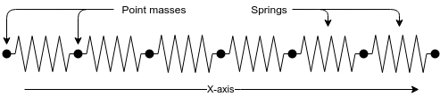

<style type="text/css">
.table {
  width: 40%;
}
</style>

## (or how to mix C++/C/Fortran codes into Stan)

This is a write-up of the experience we (two engineering graduate students at UC Santa Barbara) had integrating some custom software (a model of mechanical resonance in linear elastic materials) into Stan.

We started off using Bayesian inference on our problem because the optimization techniques we tried weren't working. At the recommendation of a coworker, we made a small sampler using Radford Neal's "MCMC Using Hamiltonian Dynamics" paper [@radford2012] and it surprised us how well it worked (and how consistently reasonable the answers were). Eventually we moved to Stan to take advantage advanced samplers and modeling language flexibility.

We'll save the preaching for the conclusion, but it's our opion that everyone out there with little science codes should be hooking them up to Stan. Be they weird ODEs, or complex PDEs, or whatever. This notebook is here to facilitate this.

Shoutouts to Ben Goodrich and Bob Carpenter for walking us through this originally. The implementation here takes advantage of special interfaces in RStan and CmdStan. I'm not sure how well any of this information transfers to the other interfaces (PyStan, MatlabStan, ...).

We start with a little background on our problem. It's optional, but it should help motivate what we're doing. We then walk through the math for a simple 1D version of our problem, how to implement this in Stan and eventually how to interface external software with Stan to solve this problem (that uses efficient, custom gradients instead of relying entirely on autodiff). Finally we go over a couple examples of how this model is applied to real data and the results from this (along with a discussion of where the model fails).

## Application Background (Optional)

The problem we worked on was the inference bit of Resonance Ultrasound Spectroscopy (or more shortly, RUS). RUS is the process of extracting elastic constants of materials by measuring the resonance modes of a sample of that material (a couple standard references are [@visscher1991c] and [@migliori1993c]). The most famous example of mechanical resonance is the Tacoma Narrows Bridge Failure, where wind agitated the bridge near a resonance mode of the structure and led to its collapse. The key to RUS is understanding that the location of the bridges resonance modes are a function of its elastic properties (how difficult it is to stretch and deform) and its shape. For the most part, we know how things are shaped and we can measure where they resonate. The thing we want to back out of this are the material elastic properties.


Long story short, we can't do this for structures so complicated as the Tacoma Narrows Bridge, and we aren't that interested in those materials anyway. The driving application here are gas turbines (see: jet engines, and land based power generation). Basically all the critical components of a gas turbine (the blades, the rotor, the housing, ...) are made of special, high temperature metals called "superalloys". It's the elastic constants of superalloys that we want to know.

For superalloys, RUS gives us a few things:

1. High precision estimates of elastic constants (conventional mechanical testing only accurate to 10%~ or so)
2. A way to evaluate the mechanical properties of materials at high operating temperatures (we're not quite there yet, but I know the collaborators are moving in this direction and I'm excited to see how it works)
3. A non-destructive way to evaluate samples (the catch here is that getting samples requires cutting them out of blades, which naturally destroys the blades, so from some perspectives I'm lieing here)

This all goes into operating turbines safely at high temperatures (which makes them more efficient).

Perhaps a more interesting picture for folks that ride planes is what a superalloy looks like under a microscope when it is new and after it's been in use for awhile.

[Picture of before and after superalloy rafted microstructure]

It's the mechanical properties of these materials we want to understand.

## Basic Mechanics (At least kinda pay attention to this)

Our application is in three dimensions, but we'll start with 1-dimensional problem, that of a series of point masses connected by massless, perfectly linear springs.

 

Because the springs are linear, we can model the forces in this system with Hooke's law. This assumes there is only one constant ($k$) which determines the elastic properties of the material:

\begin{align}
F = -k d\\
\end{align}

$F$ is force exerted by the spring, $d$ is displacement of the spring away from its resting length, $k$ is the spring constant.

Assuming all the springs in our system have the same elastic constant, and all the point masses weight the same, we can sum the forces and write out the ODE which governs the movement of each point mass. Because of the resting lengths, instead of writing the ODEs in terms of the displacements ($d_i$) of the point masses from their resting position.

\begin{align}
m \frac{\partial ^2 d_i}{\partial t^2} = -k (d_i - d_{i - 1}) + k (d_{i + 1} - d_i) \\
m \frac{\partial ^2 d_i}{\partial t^2} = k (d_{i - 1} - 2 d_i + d_{i + 1})
\end{align}

In matrix form, this is:

\begin{equation}
m \frac{\partial ^2 d}{\partial t^2} = -\begin{bmatrix}
    -2 k  &  k & 0 &  \\
    k  &  -2 k & k &  \\
    0  &  k & -2 k &  \\
       &    &   & \ldots
\end{bmatrix} d
\end{equation}

The matrix on the right hand side is called the stiffness matrix (and usually denoted $K$ for short). Because resonance is a steady state phenomena and we're working with linear systems, we can instead look at the Fourier transform of our system:

\begin{align}
m \omega^2 \hat{d} = -K \hat{d} \\
\end{align}

The square root of the eigenvalues ($\omega^2$) of this discrete problem approximate the resonance modes in the actual system. Ideally we can measure some resonance modes and then solve the inverse problem to back out exactly what $k$ was.

## Stan Model (You should be awake by now)

This is about to get complicated. We're going to generate data and then work through three versions of the same model:

1. The first will be the generic model written entirely in Stan
2. The second will be the same except the eigenvalue calculation is done in C++ and autodiffed automatically by Stan (via Eigen)
3. The third will be the same but now the eigenvalue calculation as well as the gradient calculation are done externally (still in Eigen) and then provided to Stan.

The third case is the valuable one. It's the path for hooking into Stan custom calculations that are:

1. Too expensive to practically autodiff (like the eigenvalue calculations we'll need here)
2. Too complicated to be of general interest to the Stan community
3. Too technically fragile to become part of the Stan Math library

A lot of scientific codes, in one way or another, fit in these categories.

### Generating data

First, let's generate some example resonance data from a known elastic constant (with a little Gaussian noise). To keep things fast, we'll stick with N = 10 point masses in the system. Also, we'll ignore the smallest eigenvalue in this system (it's always zero).

```{r}
library(tidyverse)
library(ggplot2)
library(rstan)

k = 1.7 # This is what we'll try to estimate
m = 1.0 # This is the mass of the load
N = 10 # Discreization of domain
sigma = 0.1 # Noise scale

x = seq(0.0, 1.0, length = N)
K = matrix(0, nrow = N, ncol = N)

for(n in 1:N) {
  # we bring the negative sign and mass
  # to the right side before computing the eigenvalues
  if(n == 1) {
    K[n, n] = k / m;
    K[n, n + 1] = -k / m;
  } else if(n == N) {
    K[n, n - 1] = -k / m;
    K[n, n] = k / m;
  } else {
    K[n, n - 1] = -k / m;
    K[n, n] = 2 * k / m;
    K[n, n + 1] = -k / m;
  }
}

r = eigen(K, symmetric = TRUE)

# Ignore the first eigenvalue, it's always
eigenvalues = rev(r$values)[2 : N]

# Remember, the resonance modes we measure are the square roots of the eigenvalues!
data = list(y = sqrt(eigenvalues)) %>% as.tibble %>%
  mutate(ynoise = y + rnorm(nrow(.), 0, sigma))

data$ynoise
```
These are the noisy measurements of the resonance modes of the system.

### Entirely Stan Model

Now, we just repeat these calculations in a Stan model to do our inference:

```{bash, echo=TRUE}
cat "models/spring_example.stan"
```
Then we run the fit:

```{r, results="hide"}
fit = stan("models/spring_example.stan", data = list(N = N,
                                                     M = nrow(data),
                                                     y = data$ynoise,
                                                     m = m), iter = 1000, chains = 4, cores = 4)
```

```{r}
print(fit, pars = c("k", "sigma"))
```
Not too shabby! The posterior contains the answer we were looking for and the n_eff and Rhat values look good.

### Eigenvalues in templated C++ (with Eigen)

Now, if we have some fancy templated C++ code that solves part of our problem, we can hook that up in Stan and let the autodiff magically compute derivatives of it. There are limits to what the autodiff can do, your mileage may vary. As of Stan 2.17.0, the ```eigenvalues_sym``` function is actually just a wrapper around the Eigen C++ templated eigensolver. We can replace the ```eigenvalues_sym``` function with our own wrapper and open the door to incorporating custom C++ directly in our Stan models!

Basically all the following stuff is shamelessly stolen from Ben Goodrich's Vignette on calling external C++ from Stan (https://cran.r-project.org/web/packages/rstan/vignettes/external.html).

The first step is defining the signature for the function you want to call in your Stan model. In our case, the signature is:

```
functions {
  vector eigenvalues_sym_external(matrix K);
}
```

Once we have that, we need to figure out what function we need to define in C++ so that Stan can call it. Stan models are compiled from Stan to C++ before being compiled to a binary and executed. We can get the C++ function signature by just doing Stan->C++ conversion and looking at the intermediate file. This is most easily done with the ```stanc``` utility in CmdStan:

```{bash}
# The --allow_undefined flag is used here to keep Stan from throwing errors saying that
# "eigenvalues_sym_external" is not part of the math library
/home/bbales2/cmdstan/bin/stanc --allow_undefined models/spring_example_external.stan > /dev/null
grep -m 1 -B2 "eigenvalues_sym_external" spring_example_external_model.cpp
```
This is the function we need to define externally. First, a quick message about types. All functions you interface with Stan will be templated on non-integer types. The two template types you need to worry about (the two types that ```T0__``` can take in this case) are ```double``` and ```var```. Basically, ```double``` is used in situations where no autodiff is needed, and ```var``` is used in places where the autodiff is needed. ```var```s are special types which, when just evaluating functions, act like doubles. In the background, however, they build special evalulation trees which can be used to get the gradients of whatever function they're used in. It's a bit finicky to describe, but to interface with the C++ side of Stan at any reasonable level you'll need to familiarize yourself with them. The best way to do that is the Stan Math paper: https://arxiv.org/abs/1509.07164.

Either way, our function definition is a bit messy, but it's actually very easy to write (we do this in a separate C++ header file):
```{bash}
cat eigenvalues_eigen.hpp
```
Because we're just passing the ```var```s through, all the gradients we need are computed automatically. Now all we need to do is run the model. We need to tell Rstan to allow undefined functions (so the Stan->C++ compilation will continue even though ```eigenvalues_sym_external``` isn't defined at that point) and the point to the header where the function is actually defined (for more details on this -- it very well may change, look at https://cran.r-project.org/web/packages/rstan/vignettes/external.html):

```{r, results="hide"}
model = stan_model("models/spring_example_external.stan",
                   allow_undefined = TRUE,
                   includes = paste0('\n#include "', file.path(getwd(), 'eigenvalues_eigen.hpp'), '"\n'))
```
```{r}
fit = sampling(model, data = list(N = N,
                                  M = nrow(data),
                                  y = data$ynoise,
                                  m = m), iter = 1000, chains = 4, cores = 4)
```
```{r}
print(fit, pars = c("k", "sigma"))
```

Again we've recovered our parameters, good work us!

### Eigenvalues with custom gradients

The last piece we need to really incoporate custom code in Stan are custom gradients. In particular, for our problem, there's no reason to make the autodiff compute the gradients of a symmetric eigenvalue problem. When they exist, there is a simple analytic form for them [@deleeuw2007]. For the eigenvalue problem (again, I hid $m$ inside the $K$ here)

\begin{align}
\omega_i^2 \hat{x} = K \hat{x}
\end{align}

With eigenvalues $\omega_i^2$ and eigenvectors $\nu_i$, the gradients of the eigenvalues with respect to some parameter $k$ are

\begin{align}
\frac{\partial \omega_i^2}{\partial k} = \nu_i^T \frac{\partial K}{\partial k} \nu_i
\end{align}

We can hook these into the Stan math autodiff using the Stan math precomputed_gradients helper (more examples here: https://github.com/stan-dev/math/wiki/Adding-a-new-function-with-known-gradients). If you haven't read the manual yet, now's the time!

Since we know $\frac{\partial K}{\partial k}$ is just ```K_unscaled``` as defined in our original Stan model, it's easiest to just pass that and ```k``` in as arguments (instead of autodiffing that matrix manually, which would be unnecessarily costly).

Our new function signature is:
```
functions {
  vector eigenvalues_sym_external_gradients(matrix K_unscaled, real k);
}
```

Again, we can use ```stanc``` to back out the signature we need to define:

```{bash}
/home/bbales2/cmdstan/bin/stanc --allow_undefined models/spring_example_external_gradients.stan > /dev/null
grep -m 1 -B2 -A1 "eigenvalues_sym_external_gradients" spring_example_external_gradients_model.cpp
```

The code with the custom autodiffs is complicated by the fact that we need to differentiate between when the template arguments are ```double```s or ```var```s. If the input includes ```var```s, then we need to get all the necessary partial derivatives together and package them in the output. If the input is only ```double```, then we can get away without computing any gradients.

It can be tricky to write functions that work with two types (even if they are closely related). It's possible to just write two separate ```eigenvalues_sym_external``` functions, one defined for ```var```s and one defined for ```double```s.

```{bash}
cat eigenvalues_eigen_gradients.hpp
```
```{r, results="hide"}
model = stan_model("models/spring_example_external_gradients.stan",
                   allow_undefined = TRUE,
                   includes = paste0('\n#include "', file.path(getwd(), 'eigenvalues_eigen_gradients.hpp'), '"\n'))
```

```{r}
fit = sampling(model, data = list(N = N,
                                  M = nrow(data),
                                  y = data$ynoise,
                                  m = m), iter = 1000, chains = 4, cores = 4)
```
```{r}
print(fit, c("k", "sigma"))
```

Woohoo! Our fit works (and is about ten times faster than it was). This is how you hook up custom external libraries with Stan models. Your mileage may vary, of course, and it's best to test that the functions (as well as their gradients) are working outside of Stan before you try to incorporate them into a complicated model.

But once it's all together, you can bask in all the benefits that Stan modeling brings.

1. Estimate noise, don't just minimize least squares
2. Handle missing data
3. Painlessly incorporate models in high level analysis (in our case, maybe a regression of material composition vs. elastic constants is in order)
4. ...

You can also flirt with the other inference algorithms (ADVI or optimization), but it's probly best to tread lightly there (it was optimization that drove us to Stan in the first place).

That's basically it folks. Feel free to hang around for a quick run through of the results we got in our actual application.

## More Mechanics

The samples we're interested in are only marginally more complicated than what we've discussed. In modern superalloys, we're almost always interested in single crystal materials. This means that instead of a one parameter elasticity model, we work with somewhere between two and nine constants (depending on the symmetry of the crystal).

[Picture of single crystal turbine blade. All the atoms in this blade are aligned in a grid]

The single stiffness constant from before turns into a 6x6 matrix of elastic constants

\begin{equation}
\underbrace{\begin{bmatrix}
    c_{11}  &  c_{12} & c_{12} & 0 & 0 & 0 \\
    c_{12}  &  c_{11} & c_{12} & 0 & 0 & 0 \\
    c_{12}  &  c_{12} & c_{11} & 0 & 0 & 0 \\
    0  &  0 & 0 & c_{44} & 0 & 0 \\
    0  &  0 & 0 & 0 & c_{44} & 0 \\
    0  &  0 & 0 & 0 & 0 & c_{44}
\end{bmatrix}}_{\text{Cubic symmetry elastic constant matrix}}
\quad
\underbrace{\begin{bmatrix}
    c_{11}  &  c_{12} & c_{13} & 0 & 0 & 0 \\
    c_{12}  &  c_{11} & c_{13} & 0 & 0 & 0 \\
    c_{13}  &  c_{13} & c_{33} & 0 & 0 & 0 \\
    0  &  0 & 0 & c_{44} & 0 & 0 \\
    0  &  0 & 0 & 0 & c_{44} & 0 \\
    0  &  0 & 0 & 0 & 0 & \frac{(c_{11} - c_{12})}{2}
\end{bmatrix}}_{\text{Hexagonal symmetry elastic constant matrix}}
\quad
\ldots
\end{equation}

Also, because we're dealing with single crystal materials, the alignment between the crystal axes and the sample axes, the crystal-sample misorientation, is important (especially since our sample has symmetry itself). The effective matrix of stiffness coefficients of the specimen can be computed by rotating the matrix the matrix from the unrotated systems. This is done by expressing the the 6x6 compliance matrices as 3x3x3x3 tensors and multiplying by rotation matrices

\begin{equation}
C^{\text{effective}}_{ijkl} = q_{ip} q_{jq} C^{\text{unrotated}}_{pqrs} q_{kr} q_{ls}
\end{equation}

We estimate the misorientation ($q$) online. It's possible to measure these things accurately with x-ray diffraction, but it is time consuming and difficult. Instead, we infer it as part of our problem. This means sampling in the space of 3D rotations, which is a bit of a trick.

## Results

The code for these calculations is probably not of general interest, but there is a hacked together version of [CmdStan](https://github.com/bbbales2/cmdstan-rus) along with the necessary [extra headers](https://github.com/bbbales2/modal_cpp) that can be used to repeat the calculations here.

To summarize, the primary issues we encounter with our fits are:

1. Not all chains converge to a reasonable solution (some get stuck in places of parameter space far away from the data). We just discard these. Not terribly satisfying but there's not much else to do.
2. Computing eigenvalues is expensive (usually matrices are 1000x1000+ in these calculations). Making the calculations high enough resolution to avoid biasing the inferences is difficult.
3. The posteriors are frighteningly tight (we're a little bit off in no-mans land here -- nothing to compare against).
4. Orientations are a real pain to work with.

### Titanium results (cubic symmetry, no misorientation necessary)
This calculation was done with four chains, 500 warmup iterations and 500 post-warmup iterations. For the example chains I ran for StanCon, two out of the four failed to find a reasonable answer.

The [model](https://github.com/bbbales2/cmdstan-rus/blob/develop/examples/cubic.stan) and [data](https://github.com/bbbales2/cmdstan-rus/blob/develop/examples/ti.20modes.dat) are available on Github.

The posterior predictives for the two simulations that worked

For some illustration of how unreasonable one of the failed fits is, here is a posterior predictive

The reference values for the table come from [@fisher1964]. I included estimates from one of the "unreasonable" chains just to give an idea of what a bad fit looks like.

\begin{align}
  \begin{array}{c c c}
  \text{Parameter} & \text{Reference (citation in text)} & \text{Estimate ($\mu \pm \sigma$)}\\
  \hline % \\
  c_{11} & 165.1 \text{GPa} & 170.3 \pm 1.5 \text{ GPa} \\
  c_{44} & 43.30 \text{GPa} & 44.92 \pm 0.01 \text{ GPa} \\
  \sigma & -         			& 414 \pm 58 \text{ Hz} \\ 
  A      & 1.000 & 1.000 \pm 0.002 \\
  \end{array}
\end{align}

### CMSX-4 results (cubic symmetry, must estimate misorientation)

This calculation was done with four chains, 500 warmup iterations and 500 post-warmup iterations. All four chains converged to the same solutions.

The [model](https://github.com/bbbales2/cmdstan-rus/blob/develop/examples/cubic_w_rotations.stan) and [data](https://github.com/bbbales2/cmdstan-rus/blob/develop/examples/cmsx4.20modes.dat) are available on Github.

The reference data for the comparison comes from [@sieborger2001].

\begin{align}
  \begin{array}{c c c}
  \text{Parameter} & \text{Reference (citation in text)} & \text{Estimate ($\mu \pm \sigma$)}\\
  \hline % \\
  c_{11} & 252 \text{GPa} & 249.2 \pm 4.0 \text{ GPa} \\
  c_{44} & 131 \text{GPa} & 131.4 \pm 0.3 \text{ GPa} \\
  \sigma & -         			& 229 \pm 37 \text{ Hz} \\ 
  A      & 2.88 & 2.865 \pm 0.008 \\
  \end{array}
\end{align}

Misorientation is a per-sample thing, so instead of referencing literature for a value we measured one ourselves with X-ray.

\begin{align}
\begin{array}{c c c}
  \text{Parameter} & \text{XRD measurement} & \text{Bayesian estimate ($\mu \pm \sigma$)} \\
  \hline % \\
  w & 0.987 & 0.9884 \pm 0.0003 \\
  x & -0.00526 & 0.000 \pm 0.0062 \\
  y & -0.158 & -0.1512 \pm 0.0024\\
  z & 0.0164 &  0.001 \pm 0.010 \\
\end{array}
\end{align}

#### Misorientation (a little boring, but it's a part of the model that isn't great so it's gotta be here)
Originally we parameterized the misorientations in Stan as quaternions (4 element ```unit_vector```s). There were issues with sampling where the treedepth would max out. The answers seemed physical, but it was just taking a long time to do the inferences. In the end we switched parameterizations of our orientations to Cubochoric coordinates [@degraef]. The treedepths stayed sane, and the results still seemed good.

The difference between the parameterization is that a ```unit_vector[4]``` maps a four parameter volume to a three parameter surface, but the Cubochoric parameterization maps a three dimensional volume to a three dimensional surface (with a volume preserving transformation). I won't pretend that I know how it works, and Betancourt has warned me enough on the forums that I should be suspicious of this topology, so caveat emptor.

Because there are numerous symmetries in the crystal and the sample, there are multiple symmetrically equivalent correct answers. This means computing $\hat{R}$ and $n_{eff}$ isn't straightforward.

What we mostly do for rotations is just check that the chains are exploring their local modes a lot (the traceplots look wiggly). For the CMSX4 data, we measured the crystal-sample misorientation manually (with X-ray), and can compare that with the misorientation computed from the HMC run. In this case, the posterior of distances between the measured misorientation and the the computed misorientations is $__$ degrees. From a physical perspective, it's pretty cool that we were able to get within half a degree. From a Bayesian perspective, it's pretty unnerving the measurement sits that far outside the posterior. We should really collect some more X-ray measurements and see which way the needle swings (is our model okay, or is something wrong) -- that's clear enough.

## Conclusion (Soap-Box)

Looking back on the project, the big mistake we made at the beginning was assuming that because we have a simple mechanical problem (linear elasticity is quite easy) that it should also be easy to solve an inference problem attached to this. This is totally untrue. Any inference problem is hard, and even simple models have 

The thing that sampling and Bayesian inference gave us that we really didn't have before is a way to aggressively interrogate our models in a way that our optimization techniques just never did. It's about more than uncertainties. We honestly don't fully trust the uncertainties we get from our models (or at least I don't), and there's no way (just like with any estimation technique) that we could recommend people use this numbers with no safety factors.

The most important thing that Bayesian modeling did for this project was help us really understand out model (and our parameter space). Even now, when we have what we consider a functional model, it is absolutely clear what the weaknesses are (misorientations) and what statistical concepts (data is uncomfortably far outside the posterior estimates, $\hat{R}$ and $n_{eff}$ unattainable) and mathematical concepts (topology issues, multimodal posteriors) are attached to this. It is absolutely clear from the diagnostics what we should do to strengthen our model (collect more X-ray data). This sort of diagnostic information comes for free using Bayesian samplers. It is not nearly so easy to get with other techniques.

It is for this reason that we strongly recommend that anyone who takes their science seriously should be figuring out ways to get their analysis into Stan. For now, it's the most trustworthy blackbox way to analyze problems. If something else comes along, great, but until then, you can find me browsing the Stan Forums (or at bbbales2@gmail.com if you aren't into newfanged webforums).

<!-- There's a fair bit of information that we left out here. Particularly, posterior predictives were very important for us in developing and testing our models. We just don't have them here for brevity. -->

<!-- That's basically it folks! Contact me at bbbales2@gmail.com (or on the Stan forums) if you have any questions about any part of this. -->

<!-- This led us to eventually incorporate our stuff into Stan. Long story short, the mistake we made when we started this was assuming that, because our mechanics problem is easy, that inferences on it should be as well. We thought that because our calculation was just a little eigenvalue problem that we didn't need big fancy statistics -- we'd leave that to the people doing Real Computations on big fancy PDEs. -->

<!-- In our opinion, everyone needs to be doing proper Bayesian inference on their problems, and the folks with little problems might just be able to. The folks with the big PDEs are in serious trouble. -->

<!-- For the time being, "proper Bayesian inference" means Stan. It's the most trustworthy blackbox way to interrogate a model, and so the thrust of this notebook will be showing how to hook up weird models to Stan, be they fancy PDEs, or weird ODEs, or whatever. -->

# References
